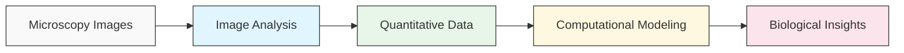
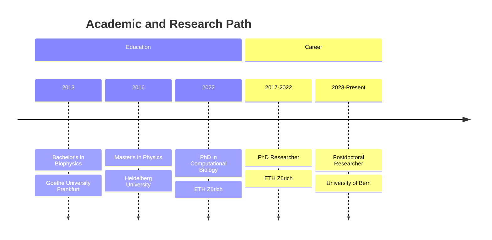

# Marco Meer - Computational Biophysicist

[ORCID](https://orcid.org/0000-0003-4501-6121) | [GitHub](https://github.com/macromeer) | [SwissBIAS](https://swissbias.github.io/members/marco.meer/)

## About Me

I am a computational biophysicist who combines computer science with biophysics to answer complex biological questions. I develop specialized computer programs to analyze microscope images of cells and tissues, helping researchers understand how biological cells interact to form and maintain tissue. Currently, I create and apply automated tools to study zebrafish heart tissue regeneration, research with implications for human heart recovery.

My work bridges the gap between detailed microscope images and mechanisms explaining cell behavior, enabling deeper insights into tissue development and regeneration.

## What I Do

### Bio-Image Analysis

I develop custom software tools that extract meaningful information from microscope images:

- Processing raw images to enhance quality
- Identifying and measuring cellular/tissue features
- Converting visual data for statistical analysis

### Technical Expertise

Languages and tools:

- Python (numerical analysis, image processing, deep learning)
- Napari (multi-dimensional image visualization)
- Version control for collaborative development

### Imaging Technologies

I work with advanced microscopy data:

- Confocal microscopy
- Whole Slide Imaging (WSI)
- Live imaging
- Lightsheet microscopy
- Electron microscopy

### Modeling \& Analysis

Computational models to explain biological processes:

- Building mathematical representations of cellular systems
- Analyzing biological data patterns
- Estimating key parameters
- Testing models with experimental data

## Career Journey

### Postdoctoral Researcher

**University of Bern, Institute of Anatomy, Developmental Biology and Regeneration Unit** (2023 - Present)

- Developed Python workflows to analyze time-lapse microscopy data of zebrafish hearts
- Created versatile methods for tracking cell healing across microscopy types
- Released open-source tools: T-MIDAS and napari-tmidas
- Collaborated with medical researchers on heart regeneration biology
- Taught image processing to students and colleagues

### PhD Researcher

**ETH Zurich, Department of Biosystems Science and Engineering** (2017–2022)

- Built cell movement models for kidney development
- Linked microscopy results with mathematical modeling
- Applied machine learning for tissue segmentation/classification
- Collaborated with experimental biologists

## Education

- **PhD in Computational Biology**, ETH Zürich (2022)
    - Thesis: "Cell-Based Simulations of Tissue Patterning During Morphogenesis"
    - Advisor: Prof. Dr. Dr. Dagmar Iber
- **MSc Physics**, Heidelberg University (2016)
    - Biophysics and image analysis focus
- **BSc Biophysics**, Goethe University Frankfurt (2013)

## Technical Skills

| Category | Skills \& Tools | Proficiency |
| :-- | :-- | :-- |
| **Image Analysis** | Filtering, morphology, segmentation, restoration, registration | Advanced |
| **Machine Learning** | Deep learning (PyTorch) | Advanced |
| **Programming** | Python, Julia, R, C++ | Advanced |
| **Scientific Software** | Napari, Cellpose, Trackastra, CAREamics, ImageJ2/Fiji | Advanced |
| **Data Visualization** | Matplotlib, seaborn, ggplot2 | Advanced |
| **Version Control** | Git, GitHub, reproducible workflows | Intermediate |
| **Computing** | HPC, parallel processing, GPU acceleration | Intermediate |

## Key Projects \& Software

| Project | Description | Technologies | Link |
| :-- | :-- | :-- | :-- |
| **T-MIDAS** | Toolkit for batch microscopy image processing; customizable and efficient workflows | Python, scikit-image, napari | [GitHub](https://github.com/MercaderLabAnatomy/T-MIDAS) |
| **napari-tmidas** | Plugin bringing T-MIDAS into the napari viewer | Python, npe2 | [GitHub](https://github.com/macromeer/napari-tmidas) |
| **Cell Migration Model** | Simulates cell movement in kidney development | C++, VTK | [Code](https://git.bsse.ethz.ch/iber/Publications/2022_Meer_NPC_Condensation) |
| **Cardiac Cell Behavior Analysis** | Measures cell response during heart tissue regeneration | Python, scikit-image, TrackMate | UniBe Initiator Grant 2024 |

## Publications

- Sharma, A. and **Meer, M.** et al. FGF signaling patterns cell behavior and morphogenesis in nephron progenitor niche. *Development*, 149(21). [DOI:10.1242/dev.201012](https://doi.org/10.1242/dev.201012)
- Chavez, M. N., et al. Lysosomal adaptation contributes to zebrafish heart regeneration. *iScience*. [DOI:10.1016/j.isci.2024.111406](https://doi.org/10.1016/j.isci.2024.111406)
- García-Poyatos, C., et al. Cox7a1-driven complex IV dimerization promotes regenerative metabolism after cardiac injury. *Developmental Cell*, 59(14). [DOI:10.1016/j.devcel.2024.04.012](https://doi.org/10.1016/j.devcel.2024.04.012)
- **Meer, M.** (2024). MercaderLabAnatomy/T-MIDAS: v0.1.9-beta. *Zenodo*. [DOI:10.5281/zenodo.10728503](https://doi.org/10.5281/zenodo.10728503)

## Certifications \& Professional Development

- Deep Learning Winter School, University of Bern (2024) - [Certificate](https://github.com/macromeer/macromeer.github.io/blob/main/certificates/Bern_DL_WinterSchool_2024_Certificate_MarcoMeer.pdf)
- Julia Scientific Programming (2020) - [Certificate](https://coursera.org/share/a62d80f195c50fd8d7c7b0ece3bb2279)
- Data Visualization with R (2022) - [Certificate](https://courses.edx.org/certificates/f4a5d4042f9c45a4892559d431aa4b2e)
- Data Analysis with R (2021) - [Certificate](https://courses.edx.org/certificates/bfb8efbaa75d4de3afa94f8599671b6d)

## Awards \& Grants

- **UniBe Initiator Grant** (2024): "Investigation of cellular behaviour in the cardiac injury microenvironment" — early career funding

## Teaching Experience

- 2025: Introduction to image processing ([MIC Training: Light Sheet Microscopy](certificates/250219-21_SPIM_program-5.pdf))
- 2023–present: Problem-based learning for medical students at University of Bern
