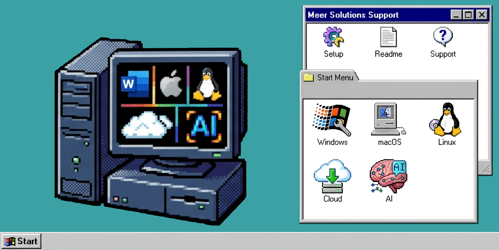
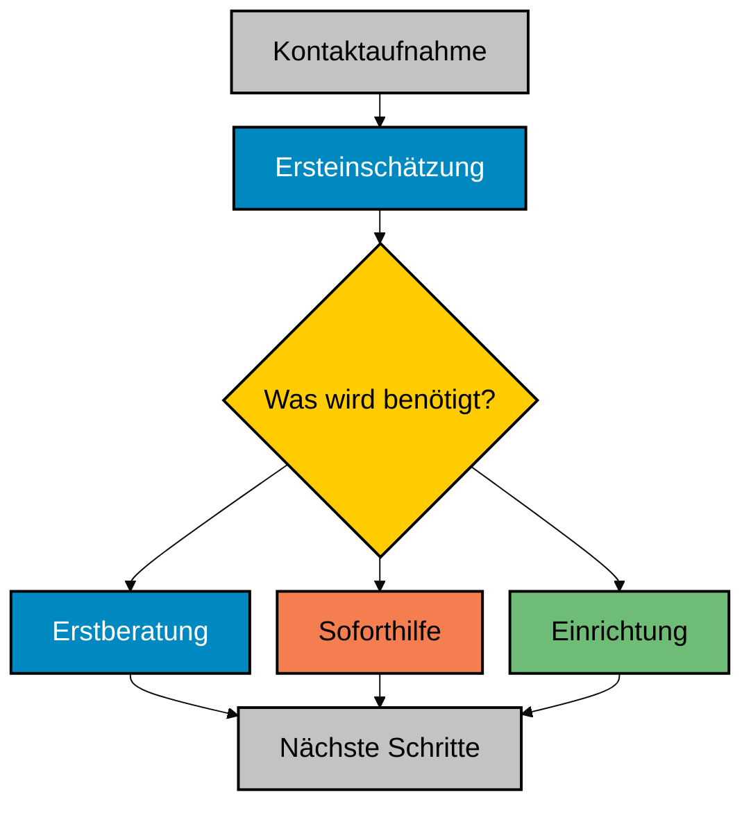

## Persönlicher Software-Support für Privatpersonen und kleine Unternehmen

<!-- Schnellnavigation: horizontale Links über dem Banner -->

  <a href="#kontakt" style="margin:0 8px; text-decoration:none; color:#000;">📞 Kontakt</a>
  <a href="#leistungen" style="margin:0 8px; text-decoration:none; color:#000;">🛠️ Leistungen</a>
  <a href="#startpakete" style="margin:0 8px; text-decoration:none; color:#000;">💼 Startpakete</a>
  <a href="#cloud-systeme" style="margin:0 8px; text-decoration:none; color:#000;">☁️ Systeme & Cloud</a>
  <a href="#standort" style="margin:0 8px; text-decoration:none; color:#000;">📍 Standort</a>

  

#### Wir helfen Ihnen schnell, verständlich und persönlich – ab Telefonat oder Videochat, auch vor Ort in Ihrer Region.

---

### 👥💬 Kontakt

**Meer Solutions**  
Telefon [076 237 73 50](tel:+41762377350)  
[meer.solutions@proton.me](mailto:meer.solutions@proton.me)  

Vor-Ort-Service im Bezirk March SZ und angrenzend (Bezirke See-Gaster, Höfe, Einsiedeln, Schwyz; Kanton Glarus).

---

### 💼 Startpakete

| Paket | Für wen | Inhalt | Pauschalpreis |
| --- | --- | --- | --- |
| Erstberatung kompakt | Privatkunden, Einzelfirmen | 45 Min. Telefon/Video, Problemaufnahme, Einschätzung, nächste Schritte | CHF 89 |
| Soforthilfe remote | Privatkunden, Kleinstunternehmen | Bis 60 Min. Fernsupport für akute Probleme | CHF 129 |
| Einrichtungs-Paket | Privatkunden, Kleinstunternehmen | 90 Min. vor Ort | CHF 179 |
| KMU-Check-in | Kleine Unternehmen | 90 Min. Erstgespräch + Kurzbeurteilung (Geräte, Accounts, Backup, Supportbedarf) | CHF 249 |

---

### ☁️ Support für Betriebssysteme, Apps, Cloud-Lösungen, KI-Integration

Wir unterstützen Sie bei Fragen rund um Betriebssysteme, Synchronisation, Konten, Backups und Cloud-Dienste –  
verständlich und ohne Fachjargon.

---

### 🛠️ Leistungen

| Leistung | Typische Themen | Supportart |
| --- | --- | --- |
| Beratung | Gerätewahl, Betriebssysteme, Cloud, Datenschutz, KI-Nutzung | Telefon, Videochat, vor Ort |
| Fehlerbehebung | PC-/Smartphone-Probleme, Drucker, E-Mail, Synchronisation | Remote, Telefon, vor Ort |
| Installation & Konfiguration | Apps, Betriebssysteme, Updates, Benutzerkonten, Backups | Remote, vor Ort |
| Cloud-Lösungen | Google Drive, OneDrive, iCloud, Proton Drive, kDrive, myCloud | Beratung, Einrichtung |
| KI-Integration | KI-Tools in Arbeitsabläufe einbinden | Beratung, Einrichtung |
| Privatkurse & Workshops | Smartphone, Messenger, soziale Medien, Videochat, Cloud | Vor Ort, Videochat |
| Individuelle Lösungen | Linux, ältere Geräte, besondere Anforderungen | Nach Absprache |

---

### 🧭 So läuft der Support ab

```mermaid
%%{init: {'theme': 'base', 'themeVariables': { 'fontSize': '20px' }, 'flowchart': { 'nodeSpacing': 20, 'rankSpacing': 25 }}}%%
flowchart TB
    A[Kontaktaufnahme] --> B[Ersteinschätzung]
    B --> C{Was wird benötigt?}
    C --> D[Erstberatung]
    C --> E[Soforthilfe]
    C --> F[Einrichtung]
    D --> G[Nächste Schritte]
    E --> G
    F --> G

    classDef gray fill:#c3c3c3,stroke:#000000,color:#000000,stroke-width:2px;
    classDef blue fill:#0089c0,stroke:#000000,color:#ffffff,stroke-width:2px;
    classDef red fill:#f47e50,stroke:#000000,color:#000000,stroke-width:2px;
    classDef green fill:#6fbc76,stroke:#000000,color:#000000,stroke-width:2px;
    classDef yellow fill:#ffcc00,stroke:#000000,color:#000000,stroke-width:2px;

    class A,G gray;
    class C yellow;
    class B,D blue;
    class E red;
    class F green;
```

---

### 🤝 Warum Meer Solutions?
- Persönliche Betreuung
- Unterstützung für **alle Betriebssysteme**, Cloud-Lösungen und KI-Integration
- Verständliche Beratung für Privatkunden und kleine Unternehmen  

---

### 📍 Standort & Vor-Ort-Region

- Tuggen SZ, Schweiz (Support-Office, kein Ladengeschäft – Termine nach Vereinbarung)  
- Vor-Ort-Service: Bezirke March, See-Gaster, Höfe, Einsiedeln, Schwyz; Kanton Glarus  

---

### ❓ FAQ – Kurze Fragen direkt

  
📞 Wie schnell können wir anfangen?

  
Gemäss Absprache oft innerhalb weniger Tage – bei akuten Problemen auch schneller per Soforthilfe remote.

  
🏠 Kommen wir auch bei Ihnen vorbei?

  
Ja, wenn Sie in einer der genannten Vor-Ort-Regionen wohnen: Bezirk March, See‑Gaster, Höfe, Einsiedeln, Schwyz, Kanton Glarus.

  
🔒 Datenschutz & Sicherheit?

  
Wir behandeln Ihre Daten gemäss revDSG und empfehlen, vor Support-Massnahmen wichtige Daten separat zu sichern.

  
🧩 Ich kenne mich nicht gut aus – können sie das übernehmen?

  
Ja, genau dafür sind wir da: für persönliche, verständliche Unterstützung, von der Einrichtung bis zum Privatkurs.

---

### 🧑‍💻 Referenzen

- Systemadministration im Hochschulbereich  
- Workshops bei Computeria Ausserschwyz  
- Webseitenadministration und Social Media Management für verschiedene Vereine  
---

  
Impressum

## Impressum

Dr. sc. ETH Marco Meer    
Geschäftsbezeichnung: Meer Solutions    
Mueslihof 2A    
8856 Tuggen SZ    
Schweiz    

E-Mail: [meer.solutions@proton.me](mailto:meer.solutions@proton.me)   
Telefon: [+41 76 237 73 50](tel:+41762377350)   

Verantwortlich für den Inhalt dieser Website:   
Dr. sc. ETH Marco Meer  

Copyright © 2026 Meer Solutions

  
Allgemeine Geschäftsbedingungen (AGB)

## Allgemeine Geschäftsbedingungen (AGB)

1. Geltungsbereich  
Diese AGB gelten für alle Dienstleistungen von Meer Solutions (Dr. sc. ETH Marco Meer, Tuggen SZ, Schweiz) im Bereich IT-Support, Beratung, Installation, Konfiguration, Cloud-Lösungen und KI-Integration für Privatpersonen und kleine Unternehmen.

2. Vertragsschluss  
Ein Vertrag entsteht durch schriftliche oder per E-Mail bestätigte Vereinbarung zwischen Ihnen und Meer Solutions. Telefonische Absprachen sind vorbehaltlich der kurzen schriftlichen/E-Mail-Bestätigung bindend.

3. Leistungen  
Meer Solutions erbringt folgende Leistungen (individuell vereinbart):
- Beratung und Fehlerbehebung für Betriebssysteme (Windows, macOS, Linux, iOS, iPadOS, Android)
- Einrichtung und Betreuung von Cloud-Lösungen
- KI-Integration in gewohnte Dienste
- Installation und Konfiguration individueller Software-Lösungen
- Praxis-Workshops und Privatkurse (Smartphone-Apps, Cloud-Dienste, Messengern, soziale Medien, Videochats)
- Support vor Ort oder per Videochat/Messenger/telefonisch  

Der genaue Leistungsumfang wird im Auftrag bzw. im Beratungsgespräch definiert.

4. Preise und Abrechnung  
- Preise werden individuell vereinbart (Pauschalpreis, Stundenansatz oder Projektpreis).
- Der vereinbarte Preis gilt ausschliesslich für die im Auftrag definierten Leistungen.
- Zusätzliche Leistungen bedürfen einer separaten Vereinbarung.
- Bei Stundenansatz: Erfasste Arbeitszeit wird nach tatsächlichem Aufwand abgerechnet.
- Fahrtkosten für Vor-Ort-Service werden gesondert berechnet, sofern nicht ausdrücklich inklusive vereinbart.

5. Zahlungsbedingungen  
- Zahlung ist ohne Abzug innerhalb von 14 Tagen nach Rechnungsstellung fällig.
- Bei Überschreitung der Zahlungsfrist sind wir gesetzlich zinspflichtig.

6. Haftung  
- Wir haften für Schäden, die auf unserer Seite durch Vorsatz oder grobe Fahrlässigkeit verursacht werden.
- Für Schäden infolge von:
  - Datenverlust
  - Fehlerhaften Drittanbieter-Diensten
  - Unsachgemässen Benutzerhandlungen
  - technischen Grenzbedingungen alter Geräte
  haften wir nicht, soweit nicht Vorsatz oder grobe Fahrlässigkeit vorliegt.
- Die Haftung für leichte Fahrlässigkeit ist auf den typischen, vertraglich erwartbaren Schaden begrenzt.
- Wir bieten keine Garantie für die Funktionsfähigkeit von Geräten, Software oder Drittanbieter-Diensten nach unserer Unterstützung.

7. Gewährleistung  
- Für unsere Leistungen gilt eine Gewährleistungsfrist von 30 Tagen bezüglich derselben Fehlerstelle.
- Innerhalb dieser Frist prüfen wir kostenlos, ob derselbe Fehler erneut auftritt und liegt in unserem Verantwortungsbereich.
- Gewährleistung gilt nicht für:
  - nachträglich von Ihnen vorgenommene Änderungen
  - neue Fehler, die nicht ursächlich mit unserer Leistung zusammenhängen
  - Probleme durch Drittanbieter-Updates oder Änderungen

8. Vor-Ort-Service  
- Vor-Ort-Service erfolgt nur nach Terminvereinbarung.
- Sie stellen uns einen geeigneten Arbeitsplatz sowie Zugang zu den betroffenen Geräten bereit.
- Sie sind dafür verantwortlich, dass keine rechtswidrigen Inhalte auf den Geräten gespeichert sind.

9. Datensicherheit und Datenschutz  
- Wir behandeln Ihre Daten gemäss unserer Datenschutzerklärung und dem revDSG.
- Sie sind verantwortlich für die Aktualität und Rechtmässigkeit der auf Ihren Geräten gespeicherten Daten.
- Wir empfehlen, vor Support-Massnahmen wichtige Daten separat zu sichern; für Datenverlust haften wir wie in Ziff. 6 geregelt.

10. Vertragsdauer und Kündigung  
- Der Vertrag endet nach vollständiger Erbringung der vereinbarten Leistungen.
- Sie können den Vertrag vor vollständiger Erbringung kündigen; bereits erbrachte Leistungen werden abgerechnet.

11. Gerichtsstand und geltendes Recht  
- Gerichtsstand, soweit gesetzlich zulässig, ist Tuggen SZ, Schweiz
- Es gilt das Recht der Schweiz.

12. Salvatorische Bestimmung  
Sollte eine Vereinbarung gegen gesetzliche Bestimmungen verstossen, bleibt die Wirksamkeit der restlichen Vereinbarung unberührt. Die betroffene Bestimmung wird durch eine entsprechende gesetzkonforme Regelung ersetzt.

Stand: Juni 2026  
Meer Solutions  
Dr. sc. ETH Marco Meer

  
Datenschutzerklärung

## Datenschutzerklärung

Diese Website wird von Meer Solutions betrieben.  

Diese Website verwendet keine Cookies, kein Tracking und keine Analytics-Dienste.  

Beim Aufruf dieser Website werden jedoch aus technischen Gründen personenbezogene Daten durch den Hosting-Anbieter GitHub verarbeitet, insbesondere die IP-Adresse des aufrufenden Geräts. GitHub weist darauf hin, dass beim Besuch einer GitHub-Pages-Website die IP-Adresse der Besucher zu Sicherheitszwecken protokolliert und gespeichert wird. [GitHub Privacy Statement](https://docs.github.com/site-policy/privacy-policies/github-privacy-statement)

Die Verarbeitung erfolgt zum Zweck des sicheren und stabilen Betriebs der Website.  

Für datenschutzrechtliche Anliegen können Sie uns unter folgender Adresse kontaktieren: [meer.solutions@proton.me](mailto:meer.solutions@proton.me)

