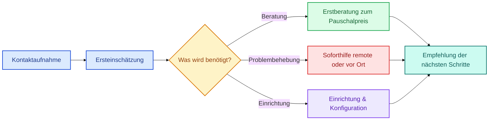

## Persönlicher Software-Support für Privatpersonen und kleine Unternehmen 

  

### Support für alle Betriebssysteme, Apps, Cloud-Lösungen, KI-Integration, Messenger, soziale Medien
#### Microsoft Windows, Google Android, Apple iOS/macOS/iPadOS/watchOS, alle Linux-Distributionen 

## Kontakt
**Meer Solutions**   
[Telefon 076 237 73 50](tel:+41762377350)  
meer.solutions@proton.me

## Leistungen

| Leistung | Typische Themen | Supportart |
| --- | --- | --- |
| Beratung | Gerätewahl, Betriebssysteme, Cloud, Datenschutz, KI-Nutzung | Telefon, Videochat, vor Ort |
| Fehlerbehebung | PC-Probleme, Smartphone-Probleme, Drucker, E-Mail, Synchronisation | Remote, Telefon, vor Ort |
| Installation & Konfiguration | Apps, Betriebssysteme, Updates, Benutzerkonten, Backups | Remote, vor Ort |
| Cloud-Lösungen | Google Drive, OneDrive, iCloud, Proton Drive, kDrive, myCloud | Beratung, Einrichtung |
| KI-Integration | KI-Tools in bestehende Arbeitsabläufe einbinden | Beratung, Einrichtung |
| Privatkurse & Workshops | Smartphone, Messenger, soziale Medien, Videochat, Cloud-Dienste | Vor Ort, Videochat |
| Individuelle Lösungen | Linux, ältere Geräte, besondere Anforderungen | Nach Absprache |

Support nach Absprache vor Ort oder per Videochat, Messenger oder telefonisch.

## So läuft der Support ab

```mermaid
%%{init: {'theme': 'base', 'themeVariables': { 'fontSize': '20px' }}}%%
flowchart LR
    A[Kontaktaufnahme] --> B[Ersteinschätzung]
    B --> C{Was wird benötigt?}
    C -->|Beratung| D[Erstberatung zum Pauschalpreis]
    C -->|Problembehebung| E[Soforthilfe remote oder vor Ort]
    C -->|Einrichtung| F[Einrichtung & Konfiguration]
    D --> G[Empfehlung der nächsten Schritte]
    E --> G
    F --> G

    classDef start fill:#dbeafe,stroke:#1d4ed8,color:#1e3a8a,stroke-width:2px;
    classDef decision fill:#fef3c7,stroke:#d97706,color:#92400e,stroke-width:2px;
    classDef consult fill:#dcfce7,stroke:#16a34a,color:#166534,stroke-width:2px;
    classDef urgent fill:#fee2e2,stroke:#dc2626,color:#991b1b,stroke-width:2px;
    classDef setup fill:#ede9fe,stroke:#7c3aed,color:#5b21b6,stroke-width:2px;
    classDef result fill:#ccfbf1,stroke:#0f766e,color:#115e59,stroke-width:2px;

    class A,B start;
    class C decision;
    class D consult;
    class E urgent;
    class F setup;
    class G result;
```

## Startpakete

| Paket                | Für wen                          | Inhalt                                                                                                   | Pauschalpreis   |
| -------------------- | -------------------------------- | -------------------------------------------------------------------------------------------------------- | ----------- |
| Erstberatung kompakt | Privatkunden, Einzelfirmen       | 45 Minuten per Telefon oder Video, Problemaufnahme, Soforteinschätzung, Empfehlung der nächsten Schritte | CHF 89   |
| Soforthilfe remote   | Privatkunden, Kleinstunternehmen | Bis 60 Minuten Fernsupport für akute Probleme        | CHF 129 |
| Einrichtungs-Paket   | Privatkunden, Kleinstunternehmen | 90 Minuten vor Ort*                       | CHF 179 |
| KMU-Check-in         | Kleine Unternehmen               | 90 Minuten Erstgespräch plus Kurzbeurteilung von Geräten, Accounts, Backup und Supportbedarf             | CHF 249 |

*Vor-Ort-Service möglich in den Bezirken March, See-Gaster, Höfe, Einsiedeln, Schwyz und im Kanton Glarus

## Warum entscheiden Sie sich für Meer Solutions?

- Persönliche Betreuung ab Handschlag 🤝 | [Kontakt](#kontakt)
- Technische Unterstützung für [alle Betriebssysteme](#alle-betriebssysteme), [Cloud-Lösungen](#cloud-lösungen) und KI-Integration
- Verständliche Beratung für Privatkunden und kleine Unternehmen

## Support für alle Betriebssysteme & Cloud-Lösungen

Cloud-Dienste ermöglichen das Sichern und Teilen von Daten, unterscheiden sich aber bei:
- Integration in gewohnte Dienste
- Datenschutz
- Anwendungsmöglichkeiten

In einem Beratungsgespräch wird die ideale Lösung ermittelt.  
Einrichtung von Datenspeichern im Heimnetzwerk ist ebenfalls möglich.

| Kategorie | Name | Support / Besonderheit |
| --- | --- | --- |
| Betriebssystem | Windows | Einrichtung, Fehlerbehebung |
| Betriebssystem | macOS | Einrichtung, Fehlerbehebung |
| Betriebssystem | Linux | Beratung, individuelle Lösungen¹, Privatkurse, Fehlerbehebung |
| Betriebssystem | iOS | Einrichtung, Fehlerbehebung |
| Betriebssystem | iPadOS | Einrichtung, Fehlerbehebung |
| Betriebssystem | Android | Einrichtung, Fehlerbehebung |
| Cloud | Google Drive | Google Workspace |
| Cloud | Apple iCloud | vorwiegend Fotos und Backups |
| Cloud | Microsoft OneDrive | Office365 |
| Cloud | Swisscom myCloud | Datenzentrum in der Schweiz |
| Cloud | Infomaniak kDrive | kSuite |
| Cloud | Proton Drive | hoher Datenschutz, Proton Docs/Sheets |
| Cloud | Tresorit | hoher Datenschutz |

¹ Beispielsweise alte Geräte wieder flott machen.

## Standort

- Tuggen SZ, Schweiz  
- Support-Office (kein Ladengeschäft) – Termine nach Vereinbarung
- Vor-Ort-Service möglich im Bezirk March, Bezirk See-Gaster, Bezirk Höfe, Bezirk Einsiedeln, Bezirk Schwyz, Kanton Glarus

## Referenzen
- Webadmin [sz.grunliberale.ch](https://sz.grunliberale.ch/)
- Webadmin [pro-buechberg.ch](https://pro-buechberg.ch/)
- Instruktor [Computeria Ausserschwyz](https://www.computeria-ausserschwyz.ch/)
- Linux-Sysadmin im Hochschulbereich seit 2020

---

  
Impressum

## Impressum

Dr. sc. ETH Marco Meer    
Geschäftsbezeichnung: Meer Solutions    
Mueslihof 2A    
8856 Tuggen SZ    
Schweiz    

E-Mail: [meer.solutions@proton.me](mailto:meer.solutions@proton.me)   
Telefon: [+41 76 237 73 50](tel:+41762377350)   

Verantwortlich für den Inhalt dieser Website:   
Dr. sc. ETH Marco Meer  

Copyright © 2026 Meer Solutions

  
Allgemeine Geschäftsbedingungen (AGB)

## Allgemeine Geschäftsbedingungen (AGB)

1. Geltungsbereich  
Diese AGB gelten für alle Dienstleistungen von Meer Solutions (Dr. sc. ETH Marco Meer, Tuggen SZ, Schweiz) im Bereich IT-Support, Beratung, Installation, Konfiguration, Cloud-Lösungen und KI-Integration für Privatpersonen und kleine Unternehmen.

2. Vertragsschluss  
Ein Vertrag entsteht durch schriftliche oder per E-Mail bestätigte Vereinbarung zwischen Ihnen und Meer Solutions. Telefonische Absprachen sind vorbehaltlich der kurzen schriftlichen/E-Mail-Bestätigung bindend.

3. Leistungen  
Meer Solutions erbringt folgende Leistungen (individuell vereinbart):
- Beratung und Fehlerbehebung für Betriebssysteme (Windows, macOS, Linux, iOS, iPadOS, Android)
- Einrichtung und Betreuung von Cloud-Lösungen
- KI-Integration in gewohnte Dienste
- Installation und Konfiguration individueller Software-Lösungen
- Praxis-Workshops und Privatkurse (Smartphone-Apps, Cloud-Dienste, Messengern, soziale Medien, Videochats)
- Support vor Ort oder per Videochat/Messenger/telefonisch  

Der genaue Leistungsumfang wird im Auftrag bzw. im Beratungsgespräch definiert.

4. Preise und Abrechnung  
- Preise werden individuell vereinbart (Pauschalpreis, Stundenansatz oder Projektpreis).
- Der vereinbarte Preis gilt ausschliesslich für die im Auftrag definierten Leistungen.
- Zusätzliche Leistungen bedürfen einer separaten Vereinbarung.
- Bei Stundenansatz: Erfasste Arbeitszeit wird nach tatsächlichem Aufwand abgerechnet.
- Fahrtkosten für Vor-Ort-Service werden gesondert berechnet, sofern nicht ausdrücklich inklusive vereinbart.

5. Zahlungsbedingungen  
- Zahlung ist ohne Abzug innerhalb von 14 Tagen nach Rechnungsstellung fällig.
- Bei Überschreitung der Zahlungsfrist sind wir gesetzlich zinspflichtig.

6. Haftung  
- Wir haften für Schäden, die auf unserer Seite durch Vorsatz oder grobe Fahrlässigkeit verursacht werden.
- Für Schäden infolge von:
  - Datenverlust
  - Fehlerhaften Drittanbieter-Diensten
  - Unsachgemässen Benutzerhandlungen
  - technischen Grenzbedingungen alter Geräte
  haften wir nicht, soweit nicht Vorsatz oder grobe Fahrlässigkeit vorliegt.
- Die Haftung für leichte Fahrlässigkeit ist auf den typischen, vertraglich erwartbaren Schaden begrenzt.
- Wir bieten keine Garantie für die Funktionsfähigkeit von Geräten, Software oder Drittanbieter-Diensten nach unserer Unterstützung.

7. Gewährleistung  
- Für unsere Leistungen gilt eine Gewährleistungsfrist von 30 Tagen bezüglich derselben Fehlerstelle.
- Innerhalb dieser Frist prüfen wir kostenlos, ob derselbe Fehler erneut auftritt und liegt in unserem Verantwortungsbereich.
- Gewährleistung gilt nicht für:
  - nachträglich von Ihnen vorgenommene Änderungen
  - neue Fehler, die nicht ursächlich mit unserer Leistung zusammenhängen
  - Probleme durch Drittanbieter-Updates oder Änderungen

8. Vor-Ort-Service  
- Vor-Ort-Service erfolgt nur nach Terminvereinbarung.
- Sie stellen uns einen geeigneten Arbeitsplatz sowie Zugang zu den betroffenen Geräten bereit.
- Sie sind dafür verantwortlich, dass keine rechtswidrigen Inhalte auf den Geräten gespeichert sind.

9. Datensicherheit und Datenschutz  
- Wir behandeln Ihre Daten gemäss unserer Datenschutzerklärung und dem revDSG.
- Sie sind verantwortlich für die Aktualität und Rechtmässigkeit der auf Ihren Geräten gespeicherten Daten.
- Wir empfehlen, vor Support-Massnahmen wichtige Daten separat zu sichern; für Datenverlust haften wir wie in Ziff. 6 geregelt.

10. Vertragsdauer und Kündigung  
- Der Vertrag endet nach vollständiger Erbringung der vereinbarten Leistungen.
- Sie können den Vertrag vor vollständiger Erbringung kündigen; bereits erbrachte Leistungen werden abgerechnet.

11. Gerichtsstand und geltendes Recht  
- Gerichtsstand, soweit gesetzlich zulässig, ist Tuggen SZ, Schweiz
- Es gilt das Recht der Schweiz.

12. Salvatorische Bestimmung  
Sollte eine Vereinbarung gegen gesetzliche Bestimmungen verstossen, bleibt die Wirksamkeit der restlichen Vereinbarung unberührt. Die betroffene Bestimmung wird durch eine entsprechende gesetzkonforme Regelung ersetzt.

Stand: Juni 2026  
Meer Solutions  
Dr. sc. ETH Marco Meer

  
Datenschutzerklärung

## Datenschutzerklärung

Diese Website wird von Meer Solutions betrieben.  

Diese Website verwendet keine Cookies, kein Tracking und keine Analytics-Dienste.  

Beim Aufruf dieser Website werden jedoch aus technischen Gründen personenbezogene Daten durch den Hosting-Anbieter GitHub verarbeitet, insbesondere die IP-Adresse des aufrufenden Geräts. GitHub weist darauf hin, dass beim Besuch einer GitHub-Pages-Website die IP-Adresse der Besucher zu Sicherheitszwecken protokolliert und gespeichert wird.  

Die Verarbeitung erfolgt zum Zweck des sicheren und stabilen Betriebs der Website. Weitere Informationen zur Datenbearbeitung durch GitHub finden Sie in der Datenschutzerklärung von GitHub: [GitHub Privacy Statement](https://docs.github.com/site-policy/privacy-policies/github-privacy-statement).  

Für datenschutzrechtliche Anliegen können Sie uns unter folgender Adresse kontaktieren: [meer.solutions@proton.me](mailto:meer.solutions@proton.me)

