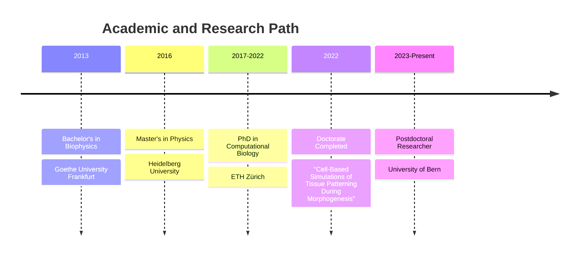
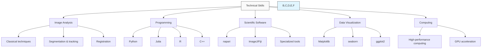

# Marco Meer - Computational Biologist

[ORCID](https://orcid.org/0000-0003-4501-6121) | [GitHub](https://github.com/macromeer)

## About Me

I'm a computational biologist and biophysicist who combines computer science with biology to solve complex problems. I develop specialized computer programs that analyze microscope images of cells and tissues, helping researchers understand how biological systems work. Currently, I'm creating automated tools to study how zebrafish hearts can regenerate after injury—research that could eventually help us understand human heart healing.

My work bridges the gap between detailed microscope images and mathematical models that explain cell behavior. This combination helps scientists gain deeper insights into biological processes like tissue development and regeneration.

## What I Do

### Bio-Image Analysis
I develop custom software tools that extract meaningful information from microscope images:
- Processing raw images to enhance their quality
- Identifying and measuring specific features within cells and tissues
- Converting visual data into numbers that can be analyzed statistically

### Technical Expertise
I work with a variety of programming languages and specialized scientific tools:
- Python (with libraries for numerical analysis, image processing, and deep learning)
- Napari (an open-source tool for multi-dimensional image visualization)
- ImageJ/Fiji (widely-used biomedical image analysis software)
- Version control systems for collaborative software development

### Imaging Technologies
I work with data from advanced microscopy techniques:
- Lightsheet microscopy (for 3D imaging of living samples)
- Confocal microscopy (for high-resolution cellular imaging)
- Live imaging (for studying dynamic processes over time)
- Electron microscopy (for ultra-detailed structural analysis)

### Modeling & Analysis
I create computational models that help explain biological processes:
- Building mathematical representations of cellular systems
- Analyzing patterns in biological data
- Estimating parameters that drive biological processes
- Testing models against experimental data

## Career Journey

### Postdoctoral Researcher
**University of Bern, Institute of Anatomy, Developmental Biology and Regeneration Unit** (2023 - Present)

* Developed custom Python-based workflows to analyze time-lapse microscopy data of zebrafish hearts, helping researchers track cellular changes during regeneration
* Created analysis methods that work with multiple types of microscopy data to measure how cells behave during tissue healing
* Built and maintained open-source software tools (T-MIDAS and napari-tmidas plugin) that make complex image analysis accessible to biologists
* Collaborated with biologists and medical researchers to connect imaging insights with the underlying biology of heart regeneration
* Taught image processing techniques to students and researchers

### PhD Researcher
**ETH Zurich, Department of Biosystems Science and Engineering** (2017 - 2022)

* Created computational models of cell movement during kidney development, helping explain how organs take shape
* Connected microscopy observations with mathematical models, making biological theories more precise and testable
* Applied machine learning to automatically identify and classify cells in complex tissue environments
* Worked closely with experimental biologists to ensure computational models accurately reflected biological reality

## Education

* **PhD in Computational Biology**, ETH Zürich (2022)
  * Thesis: "Cell-Based Simulations of Tissue Patterning During Morphogenesis"
  * Advisor: Prof. Dagmar Iber, Computational Biology Group
* **Master of Science in Physics**, Heidelberg University (2016)
  * Focus on Biophysics and Image Analysis
* **Bachelor of Science in Biophysics**, Goethe University Frankfurt (2013)

## Technical Skills

| Category | Skills & Tools | Proficiency |
|:---------|:---------------|:------------|
| **Image Analysis** | Classical techniques (filtering, morphology), feature extraction, segmentation, object tracking, restoration, registration | Advanced |
| **Machine Learning** | Deep learning for image segmentation and classification, PyTorch | Advanced |
| **Programming** | Python (numpy, pandas, scikit-image, OpenCV), Julia, R, C++ | Advanced |
| **Scientific Software** | napari, ImageJ/Fiji, Cellpose, Trackastra, BiomedParse | Advanced |
| **Data Visualization** | Matplotlib, seaborn, ggplot2 | Advanced |
| **Version Control** | Git, GitHub, reproducible workflows | Advanced |
| **Computing** | High-performance computing, parallel processing, GPU acceleration | Intermediate |

## Key Projects & Software

| Project | Description | Technologies | Link |
|:--------|:------------|:-------------|:-----|
| **T-MIDAS** | A toolkit for processing microscopy images in batches with customizable workflows. Helps researchers analyze large datasets efficiently. | Python, scikit-image, napari | [GitHub](https://doi.org/10.5281/zenodo.10728503) |
| **napari-tmidas** | A plugin that brings T-MIDAS functionality to the napari viewer, enabling interactive processing of microscopy images. | Python, npe2 | [GitHub](https://github.com/macromeer/napari-tmidas) |
| **Cell Migration Model** | A computer simulation that models how cells move and organize during kidney development, helping explain the underlying mechanisms of organ formation. | C++, VTK | [Code](https://git.bsse.ethz.ch/iber/Publications/2022_Meer_NPC_Condensation) |
| **Cardiac Cell Behavior Analysis** | A system to measure and analyze how cells respond in injured heart tissue, providing insights into the regeneration process. | Python, scikit-image, TrackMate | UniBe Initiator Grant 2024 |

## Publications

* Sharma, A. and **Meer, M.** *et al.* (2022). FGF signaling patterns cell behavior and morphogenesis in the nephron progenitor niche. *Development*, 149(21). [DOI:10.1242/dev.201012](https://doi.org/10.1242/dev.201012)
* Chavez, M. N., *et al.* (2024). Lysosomal adaptation contributes to zebrafish heart regeneration. *iScience*. [DOI:10.1016/j.isci.2024.111406](https://doi.org/10.1016/j.isci.2024.111406)
* García-Poyatos, C., *et al.* (2024). Cox7a1-driven complex IV dimerization promotes regenerative metabolism after cardiac injury in zebrafish. *Developmental Cell*, 59(14). [DOI:10.1016/j.devcel.2024.04.012](https://doi.org/10.1016/j.devcel.2024.04.012)
* **Meer, M.** (2024). MercaderLabAnatomy/T-MIDAS: v0.1.9-beta. *Zenodo*. [DOI:10.5281/zenodo.10728503](https://doi.org/10.5281/zenodo.10728503)

## Certifications & Professional Development

* Deep Learning Winter School, University of Bern (2024) - [Certificate](https://github.com/macromeer/macromeer.github.io/blob/main/certificates/Bern_DL_WinterSchool_2024_Certificate_MarcoMeer.pdf)
* Julia Scientific Programming (2023) - [Certificate](https://coursera.org/share/a62d80f195c50fd8d7c7b0ece3bb2279)
* Data Visualization with R (2022) - [Certificate](https://courses.edx.org/certificates/f4a5d4042f9c45a4892559d431aa4b2e)
* Data Analysis with R (2021) - [Certificate](https://courses.edx.org/certificates/bfb8efbaa75d4de3afa94f8599671b6d)

## Awards & Grants

* **UniBe Initiator Grant** (2024): "Investigation of cellular behaviour in the cardiac injury microenvironment" - Competitive funding awarded to early career researchers with promising research directions

## Teaching Experience

* **2025**: Introduction to image processing ([MIC Training: Light Sheet Microscopy](certificates/250219-21_SPIM_program-5.pdf))
* **2023-present**: Problem-based learning for medical students at University of Bern
